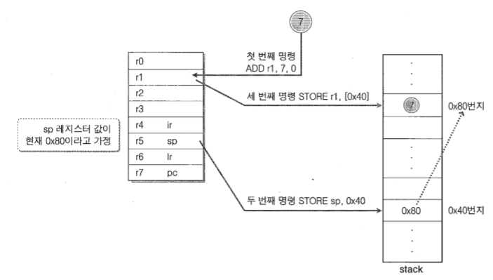

# 10장. 컴퓨터 구조에 대한 세 번째 이야기

 

## 1. 절차적 함수 호출(Procedure Call) 지원 CPU 모델

 

### 스택 프레임(Stack Frame) 구조

 

- 함수 호출 과정에서 할당되는 메모리 블록(지역변수의 선언으로 인해 할당되는 메모리 블록)
- 함수 호출이 완료(return)되면 주소를 알고 있다 하더라도 기존에 선언된 지역변수에 접근이 불가능하다.
    - 이는 할당되었던 메모리가 반환되었음을 의미하고, 해당 함수에 해당하는 할당된 스텍 프레임 모두 반환된다.

 

### sp(stack pointer) 레지스터

 

- 지역 변수를 위한 메모리 공간을 스택(stack)이라고 이름을 붙인 이유는 메모리의 구조적 특성, Last In, First Out 때문이다.
    - 스택 프레임은 가장 먼저 할당되면, 가장 나중에 반환된다.
    - 가장 나중에 할당되면, 가장 먼저 반환된다.
- 스택에 데이터를 쌓거나 반환하기 위해서는 현재 어느 위치까지 데이터를 저장했는지 기억해야 하는데, 이를 위해 CPU 내에 sp 레지스터가 존재한다.
- sp 레지스터 값은 변수가 하나씩 할당될 때 마다 증가하고, 증가하면서 다음 변수가 할당될 메모리 위치를 가리킨다.
    - 스택에 메모리를 할당할 때, 할당하고자 하는 대상 타입에 따라서 sp 값의 증가분을 계산하여 이동시키는 것은 가능하다.
    - **하지만, 호출이 완료된 함수를 빠져 나오는 시점에서, 함수 내에서 할당된 메모리 공간을 반환하기 위해 스택 프레임 단위로 sp를 이동시킬 때, 앞서 얼마 만큼의 메모리 공간을 할당했는지 알지 못한다.**
- **프레임 포인터(Frame Pointer) 레지스터**가 그 역할을 한다.

 

### 프레임 포인터(Frame Pointer) 레지스터

 

- 프레임 포인터 레지스터를 추가적으로 필요로 하게 된 배경에는 함수를 반환하는 시점에서 sp 레지스터가 가르키는 위치를 함수 호출 이전의 위치, 즉 반환하는 함수의 스택 프레임을 뺀 위치로 되돌리기 위함이다.
- 따라서, 되돌아갈 (함수 호출 이전)의 sp 위치를 fp 레지스터에 저장만 해놓아도 된다.
    - 호출하는 함수에서 아무리 많은 변수를 선언하더라도, 함수를 호출하는 과정에서 sp 레지스터에 저장된 값을 fp 레지스터에 저장했기 때문에 함수를 반환하는 과정에서 sp 레지스터는 fp 레지스터에 저장된 값을 참조해서 함수 호출 이전 위치로 sp를 이동시킬 수 있다.
    - 즉, 호출한 함수의 스택 프레임을 날려버리고 이전 위치로 되돌아간다.
- 하지만, 단순한 함수의 호출과 반환의 과정이 아닌 특정 함수 내에 중첩된 함수가 존재한다면 문제가 발생한다.
    - sp의 위치를 저장한 fp 레지스터 값이 덮어써지는 상황이 발생하고, sp 레지스터가 가리켜야 할 위치를 찾지 못하게 된다.

### 스택에 저장하자, 프레임 포인터(Frame Pointer)

 

- 함수가 중첩된 상황에서 sp의 위치를 백업한 fp 레지스터의 값이 덮어써지게 되는 문제를 해결하기 위해서, 덮어쓰이기 전에 즉 함수 호출이 일어날 때 마다 fp 레지스터에 저장되어 있는 값을 스택에 저장하는 것이다.
- 함수 호출 시, sp 레지스터에 저장된 값을 fp 레지스터에 옮기기 전에, fp 레지스터에 저장된 값을 스택에 먼저 쌓아두면 각 함수 호출에 해당하는 모든 스택 프레임의 경계 정보를 저장할 수 있다.
    - 그 다음, sp 함수 호출로 인한 스택의 위치 값을 fp 레지스터에 저장한다.
- 함수 반환 시, fp 레지스터에 저장된 값을 참조해서 sp 레지스터의 값을 변경하고 반환하고자 하는 함수의 스택 프레임을 날려버린다.
    - 그 다음, sp 레지스터가 가리키는 위치에 저장되어 있는 값을 fp 레지스터에 옮겨놓게 되고 sp 레지스터는 다시 이 값을 참조하는 방식으로 반환을 반복한다.

## 2. 함수 호출 인자의 전달과 PUSH & POP 명령어 디자인

 

- 함수 호출: 입력에 대한 출력이 반환값으로 존재
- 프로시저 호출: 출력에 해당하는 반환 값 없이 모듈화 해 놓은 서브 루틴의 실행을 위한 호출

 

**"함수 호출 시 전달되는 인자들은 어떻게 함수 내부로 전달되는가?"**

 

### 함수 호출 인자의 전달방식

 

- 함수 호출 시 전달되는 인자들은 모두 스택에 저장한다.
- 이는 앞서 살펴봤던 지역변수가 스택에 할당되는 방식과 동일하다.

 

### PUSH & POP 명령어 디자인

 

 

**PUSH**

- 1. (ADD r1, 7, 0)
    - 숫자 7을 임의의 레지스터(r1)에 저장하여, 숫자 7을 대신해서 레지스터 이름을 피연산자로 둘 수 있다.
- 2. (STORE sp, 0x40)
    - Indirect 모드 연산을 위해서 sp가 지니고 있는 값(0x80 번지)을 0x40 번지에 저장한다.
- 3. (STORE r1, [0x40])
    - 레지스터 정보를 sp를 대신해서 주소 정보를 피연산자로 할당했기 때문에 Indirect 모드로 0x40 번지를 참조해서 데이터를 저장한다.
- 4. (ADD sp, sp, 4)
    - 다음에 들어올 데이터를 저장하기 위해서, sp 레지스터의 값을 증가시킨다.

 

- 위 4개의 명령어들의 조합을 'PUSH'라고 한다.

 

**POP**

- 간단하게 ADD 명령어나 SUB 명령어를 통해서 구현할 수 있다.
- (ADD sp, sp, -stack frame size)
- (SUB sp, sp, stack frame size)

 

## 3. 함수 호출(Procedure Call)에 의한 실행의 이동

 

### 다시 살펴보는 메모리 구조와 프로그램 카운터(Program Counter)

 

 

- **코드 영역**은 프로그램이 동작하기 위한 프로그램 코드(컴파일된 명령어들의 집합)가 올라가는 위치이다.
- 프로그램을 실행시키면 위와 같은 메모리 구조가 형성되고, 코드 영역에 실행되어야 할 명령어들이 올라가서 순차적인 실행이 이뤄진다.
- 명령어의 실행은 (Fetch - Decode - Execution)인 3단계로 이루어진다. 이 때 첫 번째 단계가 명령어를 CPU 내부로 가져오는 Fetch 단계이고, 이 때 명령어를 가져오게 되는 위치는 컴파일된 프로그램 코드가 존재하는 '코드 영역'이다.
- 이 때, Fetch 단계에서 어느 위치에 있는 명령어까지 코드 영역에서 가져왔는지 기억해야 하는데, 이 정보는 CPU 내부의 'pc 레지스터'에 저장한다.
- 'pc(program counter) 레지스터'는 명령어를 순차적으로 fetch 하기 위해서 존재한다.
- CPU는 (Fetch - Decode - Executioin) 과정을 계속해서 진행하도록 구현되어 있기 때문에, Fetch 연산이 일어날 때 마다 자동적으로 pc 값이 증가한다.
- 따라서, 우리가 직접 pc 값을 컨트롤하지 않아도 된다.
- 하지만 필요에 따라 프로그램상 pc값을 직접 조절해야 하는 경우도 있다.

 

### 함수 호출과 함수 종료

 

**"함수 호출 시 실행 위치의 이동은 어떻게 이루어지는가?"**

 

**"함수 호출이 끝나고 나면 어떻게 이전 실행위치로 복귀하는가?"**

 

- 위 두 질문에 대한 대답은 'Program Counter'라고 할 수 있다.
    - pc를 조작함으로써 함수의 **순차적인 실행**뿐만 아니라 **실행되고 있던 명령어의 실행을 멈추고 함수 호출이 발생한 위치로 이동해서 명령어의 실행을 이어나가는 것** 그리고 **함수 호출이 완료된 다음 이동이 발생하기 이전 위치로 옮겨가서 실행**할 수 있다.
    - 이 때, 순차적인 실행은 문제없지만 함수 호출이 완료된 이후 이동할 주소 값을 백업해둬야 한다.
    - 이 또한 **스택**에 저장한다.

 

## 4. 함수 호출규약(Calling Convention)

 

### 함수 호출규약이란?

 

- 함수의 호출방식도 일종의 규약이다.
- 다양한 함수 호출규약이 존재하며, 어떠한 호출규약을 따를 것인가를 선언하게 되어있다.
- 함수 호출규약은 '인자를 전달하는 방식'과 '스택 프레임을 반환하는 방식'을 약속해 놓은 것이다.

 

### _cdecl, _stdcall, ...

 

- 함수 호출규약을 지정하기 위해, 함수 선언부에 _stdcall과 같은 키워드를 지정해준다.
- 따로 함수 호출규약 선언이 존재하지 않은 함수들은 디폴트 선언으로 지정되어 있는 호출규약을 따르게 된다.

 

### 호출규약의 종류와 의미

 

- 64비트 CPU는 32비트 CPU와 다른 레지스터 구조를 지닌다. 따라서 32비트 환경과는 다른 함수 호출 규약이 존재한다.
- 새로운 함수 호출규약에서는 성능의 향상을 위해서 레지스터를 더욱 많이 활용하고 있다.

