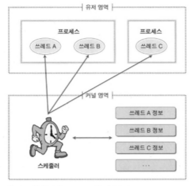

# 11장. 쓰레드의 이해

 

## 1. 쓰레드란 무엇인가?

 

### 멀티 프로세스 기반 프로그램

 

- 둘 이상의 서로 다른 프로그램 실행을 위해서 둘 이상의 프로세스를 생성하는 것

 

### 멀티 프로세스 운영체제 기반 프로그램의 문제점과 새로운 제안

 

- 서로 별개인 두 개의 프로그램 실행을 위해서 추가적인 프로세스를 생성하는 일은 어쩔 수 없는 일이지만, 하나의 프로그램이 둘 이상의 프로세스 생성을 요구하는 것은 빈번한 컨택스트 스위칭으로 인해 성능의 저하로 이어지기 때문에 부담스러운 일이다.
    - 컨택스트 스위칭: 프로세스의 상태 정보를 저장하고 복원하는 일련의 과정
    - 하나의 프로세스에서 둘 이상의 프로세스 생성으로 인해서 서로 다른 프로세스 간의 빈번한 컨택스트 스위칭이 성능의 저하로 이어진다고 했는데, 이렇게 빈번하게 발생하는 컨택스트 스위칭에 소요되는 시간을 줄이기 위한 방법은 무엇이 있을까?
    - **저장하고 복원하는 컨텍스트 정보, 즉 프로세스의 상태 정보의 개수를 줄이면 된다.**
    - **컨택스트 스위칭이 필요한 가장 근본적인 이유**는 생성된 프로세스가 부모-자식 관계에 있다고 하더라도 생성된 자식 프로세스는 서로 독립된 완전 별개의 프로세스이기 때문이다.
    - 따라서, 생성된 프로세스들이 공유하는 영역이 있다면 컨텍스트 스위칭 발생 시 저장하고 복원하는 정보도 줄어들 수 있다는 아이디어에서 탄생한 것이 바로 **쓰레드**이다.

 

### 해결책, 쓰레드

 

**프로세스와 쓰레드의 차이점**

 

- 프로세스는 완전히 독립된 두 개의 프로그램 실행을 위해서 사용된다.
- 쓰레드는 하나의 프로그램 내에서 둘 이상의 프로그램 흐름을 만들어 내기 위해 쓰레드간에 공유하는 상태 정보들이 있고, 이것이 쓰레드의 컨텍스트 스위칭을 빠르게 한다.

 

**정리**

1. 쓰레드는 하나의 프로그램 내에서 여러 개의 실행 흐름을 두기 위한 모델이다.
2. 쓰레드는 프로세스처럼 완벽히 독립적인 구조가 아니다. 쓰레드들 사이에는 공유하는 요소들이 있다.
3. 쓰레드는 공유하는 요소가 있는 관계로 컨텍스트 스위칭에 걸리는 시간이 프로세스보다 짧다.

 

### 메모리 구조 관점에서 본 프로세스와 쓰레드

 

 

 

**쓰레드의 특성 1: 쓰레드마다 스택을 독립적으로 할당해준다.**

 

- 프로세스와 마찬가지로 쓰레드도 독립적으로 스택을 할당한다.
- 스택 영역: 함수 호출 시 전달되는 인자, 되돌아갈 주소 값 및 함수 내에서 선언하는 변수 등을 저장하기 위한 메모리 공간이다. 즉, 함수 호출 시 필요한 메모리 영역
- 실행 흐름의 추가를 위한 최소 조건은 독립된 스택의 제공

 

**쓰레드의 특성 2: 코드 영역을 공유한다.**

 

- 쓰레드는 자신을 생성한 프로세스와 코드 영역을 공유하기 때문에 프로세스가 가지고 있는 함수를 호출할 수 있다.
    - 프로세스 내에 쓰레드 생성을 위해서 마련된 함수 호출을 통해 호출된 쓰레드가 생성이 되고, 프로세스 내 코드 역역에 생성된 쓰레드의 main 함수가 존재함으로써 프로세스의 코드 영역(함수)를 공유할 수 있음

 

**쓰레드의 특성 3: 데이터 영역과 힙을 공유한다.**

 

- 쓰레드 간에 힙과 데이터 영역을 공유하기 때문에 힙이나 데이터 영역에 메모리 공간을 할당해서 서로 통신하는 것이 가능하다.
- IPC와 같은 복잡한 통신기법이 필요없다.
- 전역변수와 malloc 함수를 통해서 동적으로 할당된 메모리 공간은 공유가 가능하다.
- 메모리 영역을 공유하다 보면 문제가 생길 수 있다.

 

### Windows에서의 프로세스와 쓰레드

 

- Windows 입장에서 프로세스는 단순히 쓰레드를 담는 상자에 지나지 않는다.
- 실제 프로그램의 흐름을 형성하는 것은 쓰레드이다.
- 사실, Windows 운영체제에 있어서 프로세스는 상태(Running, Ready, Blocked)를 지니지 않는다. 상태를 지니는 것은 프로세스가 아니라 쓰레드이다.
- 즉, Windows에 있어서 실행의 중심에 있는 것은 프로세스가 아닌 쓰레드이다.

 

**같은 프로세스 내에 존재하는 쓰레드 사이에서 발생하는 컨텍스트 스위칭은 프로세스 간 컨텍스트 스위칭에 비교해서 속도가 훨씬 빠르다.**

 

**서로 다른 프로세스 간 쓰레드 사이의 컨텍스트 스위칭은 각자 속한 프로세스 영역이 다르기 때문에 공유하는 영역이 없으므로 프로세스 간 컨텍스트 스위칭과 다를 바 없다.**

 

**쓰레드를 생성하지 않는 프로세스는 어떠한 방식으로 실행이 되는가?**

 

- Windows에서 쓰레드가 존재하지 않는 프로세스는 없다.
- 자식 프로세스를 생성할 때나 단순한 프로그램을 실행할 때에도 프로세스 생성과 동시에 main 함수를 호출해 줄 쓰레드를 생성한다.
- 이러한 쓰레드를 가리켜 'main 쓰레드'라고 부른다.

 

## 2. 쓰레드 구현 모델에 따른 구분

 

### 커널 레벨 쓰레드와 유저 레벨 쓰레드

 

**'유저 레벨 쓰레드와 커널 레벨 쓰레드는 기능의 제공 주체가 누구냐에 달려있다.'**

 

**커널 레벨 쓰레드**

 

- 프로그래머 요청에 따라 쓰레드를 생성 및 스케줄링하는 주체가 커널인 경우, 커널 레벨 쓰레드라고 한다. (커널 레벨에서 쓰레드가 지원된다는 뜻)

 

- 유저 영역: 사용자에 의해서 프로그램이 동작하기 위해 할당되는 메모리 공간
    - 코드 영역, 데이터 영역, 스택 및 힙 영역
- 커널 영역: 하나의 프로세스에게 할당된 총 메모리 공간 중에서 유저 영역을 제외한 나머지 영역을 커널 영역이라고 한다.
    - 운영체제라는 하나의 소프트웨어를 실행시키기 위해서 필요한 메모리 공간

 

 - 일반 프로그램을 실행시키기 위한 메모리 공간과 운영체제의 실행을 위한 메모리 공간을 분리시켜야 한다. 따라서, 유저 영역과 커널 영역을 분리하는 것

 

 

- 쓰레드에게 일을 시키기 위한 프로그램 코드는 프로그래머가 개발하므로 쓰레드 A, B, C의 실행코드는 유저 영역에 존재
- 스케줄러와 쓰레드의 정보는 커널 영역에 존재

 

**유저 레벨 쓰레드**

 

- 멀티 프로세스 운영체제라고 해서 커널이 기본적으로 쓰레드를 지원하는 것은 아니다.
- 커널에 의존적이지 않은 형태로 쓰레드의 기능을 제공하는 라이브러리를 활용하는 방식으로 제공되는 쓰레드를 유저 레벨 쓰레드라고 한다.
- 커널에서 제공하는 기능이 아니므로, 실행 시 유저 영역에서 실행됨
- 유저 레벨 쓰레드 모델을 적용할 경우, 운영체제는 쓰레드의 존재를 알지도 못하고, 확인하지도 못한다.

 

### 커널 모드와 유저 모드

 

- 일반적인 프로그램은 유저 모드에서 동작하지만, Windows 커널이 실행되어야 하는 경우에 커널 모드로 전환이 일어난다.
- 즉, 커녈 영역에서 실행이 일어나야 될 경우 커널 모드로 전환이 일어난다.
- 스케줄러의 동작은 커널의 일부이기 때문에 스케줄러가 동작하려면 커널 모드로의 전환이 일어나야 한다.

 

**커널 모드와 유저 모드의 차이점**

 

- 프로세스가 유저 모드에서 동작할 때에는 커널 영역으로의 접근이 금지된다.
- 반면에, 커널 모드에서 동작할 때에는 모든 영역의 접근이 허용된다.

 

**모드의 전환(커널 모드 <-> 유저 모드)은 시스템에 부담을 주는 일이다.**

 

- 커널 모드와 유저 모드를 제공하는 대상은 프로세서이다.
- 즉, 메모리 보호 기능이 CPU에 달려있다.

 

### 커널 레벨 쓰레드와 유저 레벨 쓰레드의 장점 및 단점

 

**커널 레벨 쓰레드**

 

- 장점: 커널에서 직접 제공해 주기 때문에 안정성과 다양한 기능성이 제공된다.
- 단점: 커널에서 제공해 주는 기능이기 때문에 유저 모드에서 커널 모드로의 전환이 빈번하게 일어나고, 이는 성능의 저하로 이어진다.

 

**유저 레벨 쓰레드**

 

- 장점: 커널은 쓰레드의 존재를 모르고, 오로지 유저 모드로 동작하기 때문에 유저 모드로의 전환이 필요없고, 성능이 좋다.
- 단점: 운영체제는 프로세스의 존재만 알고, 쓰레드의 존재를 모르기 때문에 하나의 프로세스 안에 여러 개의 쓰레드 중 하나의 쓰레드가 커널에 의해서 블로킹된다면, 그 프로세스 전부가 블로킹되는 문제가 있다.