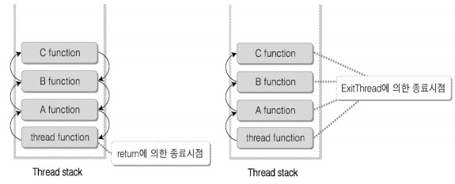
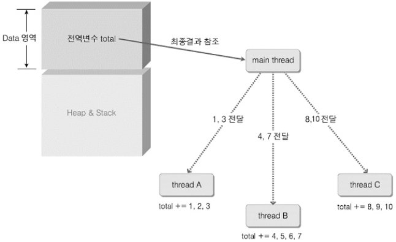
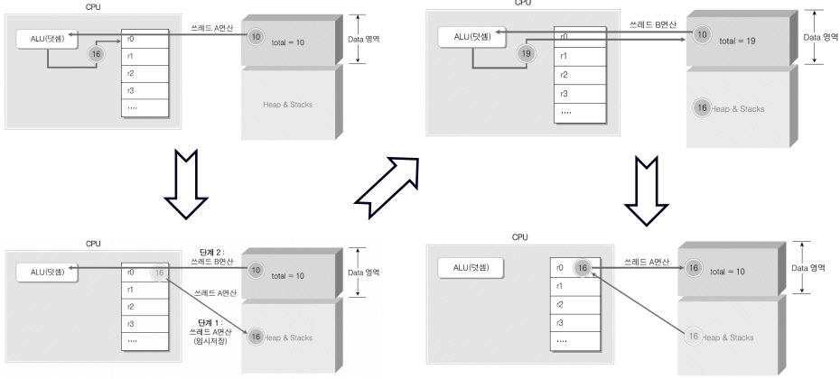
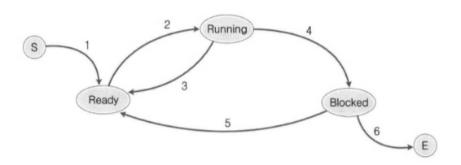
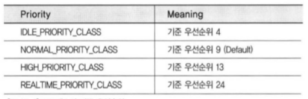
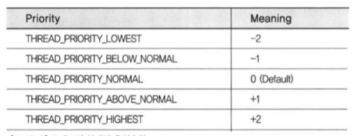

# 12장. 쓰레드의 생성과 소멸

 

## 1. Windows에서의 쓰레드 생성과 소멸

 

### 쓰레드의 생성

 

**생성할 수 있는 쓰레드의 쵀대 개수는?**

 

- 메모리가 허용하는 만큼
- 쓰레드가 생성될 때 마다 독립된 스택을 할당해 줘야만 한다. 즉, 스택을 할당할 수 있을 때 까지 쓰레드의 생성을 허용한다.
- Default 스택 사이즈는 1MB이고, 이 때 생성되는 쓰레드의 개수는 2024개이다.
    - 앞서 말한 Default 스택 사이즈는 최소한의 스택 크기로 생각해 볼 수 있고, 더 작은 스택 사이즈를 요구하더라도 1MB로 지정한다.

 

### 쓰레드의 소멸

 

**가장 이상적인 쓰레드 소멸 방법: 쓰레드 함수 내에서 return 문을 통해 종료 및 소멸시키는 방법**

 

- Case 1: 쓰레드 종료 시 return을 이용하면 좋은 경우 (거의 대부분의 경우)
    - 가정: 외부로부터 입/출력 작업이 아주 많이 요구되기 때문에, Blocked 상태에 자주 놓이게 되는 상황
    - Main thread
        - thread A
        - thread B
        - thread C
    - 총 3개의 쓰레드를 생성해서 일의 부담을 나눠준다. 
        - 정해진 시간 동안에 CPU에게 보다 많은 일을 시킬 수 있다.
        - Blocked 상태에 놓이는 상황도 3개의 쓰레드가 나눠서 감당하므로, 처리 속도가 높아질 수 있다.
    - 이 상황에서는 작업이 끝난 쓰레드가 종료됨과 동시에 결과값을 반환하는 상황이고, 이 결과 값을 main 쓰레드가 어떻게 확인하느냐가 문제이다.
        - 쓰레드 함수가 반환한 결과 값(쓰레드의 종료코드)은 프로세스의 종료코드처럼 커널 오브젝트에 그 결과가 저장된다.

 

- Case 2: 쓰레드 종료 시 ExitThread 함수 호출이 유용한 경우(특정 위치에서 쓰레드의 실행을 종료시키고자 하는 경우)
    - ExitThread 함수: 현재 실행 중인 쓰레드를 종료하고자 할 때 호출하는 함수
        - 장점: 언제 어디서나 쓰레드를 종료시킬 수 있음
        - return 문을 사용하는 것 보다 코드의 가독성이 좋다.
        - 단점: 상위 생성자 호출로 생성된 함수에서 ExitThread 함수가 호출되는 경우에는, 상위 함수의 스택 프레임에 존재하는 객체의 소멸자는 호출되지 않으므로 메모리 유출 현상이 발생할 수 있다.

         

        

 

**가장 좋은 방법은 return 문에 의한 쓰레드의 종료이다.**

 

- Case 3: 쓰레드 종료 시 TerminateThread 함수 호출이 유용한 경우 (외부에서 쓰레드를 종료시키고자 하는 경우)
    - main 함수 내에서 쓰레드를 생성할 경우, 쓰레드의 핸들을 얻을 수 있다. 따라서, 이 핸들을 이용해 쓰레드를 강제 종료시킬 수 있다.
    - 외부에 의한 강제 종료이기 때문에 종료를 하기 위해 할당받은 메모리와 리소스를 해제하는 작업을 처리하지 못하고 종료되고, 좋지 않은 방식이다.

 

## 2. 쓰레드의 성격과 특성

 

### 힙, 데이터 영역, 그리고 코드 영역의 공유에 대한 검증

 

- 쓰레드는 메모리를 공유한다.
- 특히 전역변수가 할당되는 데이터 영역과, 메모리가 동적으로 할당되는 힙 영역을 공유한다. 

 

 

**문제점**

 

[https://dakuo.tistory.com/95]

 

- 동시 접근에 있어서 문제점이 발생한다.
    - 예를 들어, main thread에서 생성된 thread A와 thread B가 데이터 영역에 있는 전역 변수를 공유하여 연산을 진행한다고 했을 때, 각각의 연산이 이루어진 메모리 또한 공유되어지기 때문에 연산 결과가 순차적으로 이루어지는 것이 아니라 결과 값이 덮어써지는 문제가 발생한다.
    - 따라서, 둘 이상의 쓰레드가 같은 메모리 영역을 동시에 참조하는 것은 문제를 일으킬 수 있다.

 

### 프로세스로부터의 쓰레드 분리

 

**프로세스 관점**

 

- 프로세스는 쓰레드를 담는 상자 역할
- 하지만, 프로세스에서 생성된 각각의 쓰레드 별로 핸들 테이블이 존재하지 않고 하나의 프로세스에 하나의 핸들 프로세스가 존재한다. 즉, 핸들 테이블은 프로세스 소유이므로 핸들 테이블의 소유자인 프로세스에게만 의미를 지닌다.
- 따라서, 핸들 테이블의 소유자가 아닌 다른 프로세스가 특정 리소스의 핸들 값을 알았다고 하더라도 그 핸들 값의 리소스에 접근하지 못한다.

 

**쓰레드의 관점**

 

- 같은 프로세스 내애서 생성된 모든 쓰레드들은 스택 이외에 모든 것을 공유하기 때문에 핸들 테이블을 공유하고, 각각의 쓰레드들에게도 의미를 지닌다.

 

### ANSI 표준 C 라이브러리와 쓰레드

 

- C 라이브러리 함수가 멀티 쓰레드 기반으로 구현된 프로그램에서 문제를 일으키지 않으려면
    - _beginthreadex 함수를 사용하여 쓰레드를 생성하기에 앞서 독립적인 메모리 블록을 할당
    - _endthreadex 함수를 사용하여 내부적으로 쓰레드에 할당된 메모리를 해제하고 ExitThread 함수 호출

 

## 3. 쓰레드의 상태 컨트롤

 

### 쓰레드의 상태 변화

 

- **Windows에서 상태가 변화하는 주체는 프로세스가 아니라 쓰레드이다.**
- 모든 상황은 프로세스의 상태 변화와 100% 동일하다.

 

 

### Suspend & Resume

 

- 쓰레드의 상태를 컨트롤 하기 위한 두 가지 함수

 

1. DWORD SuspendThread (
    HANDLE hThread
);
    - Blocked 상태에 두고자 하는 쓰레드의 핸들을 인자로 전달

 

2. DWORD ResumeThread(
    HANDLE hThread
);
    - Ready 상태에 두고자 하는 쓰레드의 핸들을 인자로 전달
    - (Blocked -> Ready)

 

## 4. 쓰레드의 우선순위 컨트롤

 

- 프로세스는 실행의 주체가 아닌 쓰레드를 담는 그릇에 지나지 않는다.
- Windows에서는 프로세스가 우선순위를 갖는 것이 아니라, 프로세스 안에서 동작하는 쓰레드가 우선순위를 갖는다.

 

**프로세스의 기준 우선순위**

 

 

**쓰레드의 상대적 우선순위**

 

 

- 쓰레드의 우선순위는 프로세스의 기준 우선순위와 쓰레드의 상대적 우선순위의 조합으로 결정된다.
- 프로세스 내에서 생성되는 모든 쓰레드의 상대적 우선순위는 'THREAD_PRIORITY_NORMAL'이다. (프로세스의 기준 우선순위를 그대로 수용)