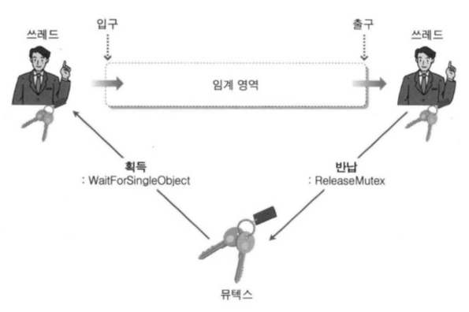
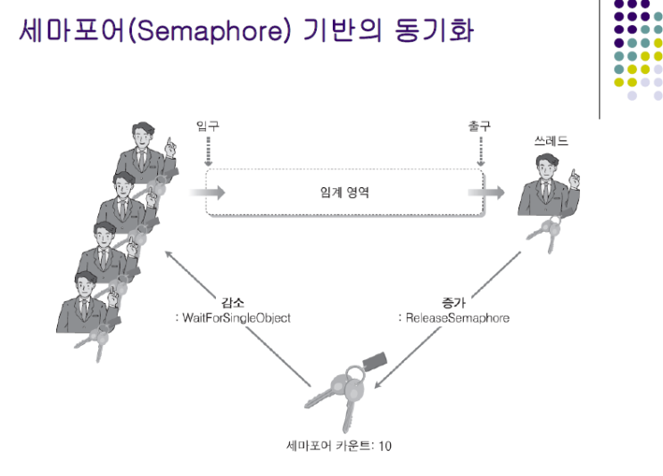
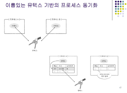

# 13장. 쓰레드 동기화 기법 1

<br/>

## 1. 쓰레드 동기화란 무엇인가?

<br/>

### 두 가지 관점에서의 쓰레드 동기화

<br/>

- 동기화: '일치한다'는 의미에서의 동기화가 아닌, 순서에 의해서 질서가 지켜지고 있음을 의미하는 동기화이다.

<br/>

**실행순서의 동기화**

<br/>

- 쓰레드의 실행 순서를 정의하고, 이 순서에 반드시 따르도록 하는 것
- 접근의 순서가 이미 정해져 있는 상황에서, 그 순서만 지켜지면 된다.

<br/>

**메모리 접근에 대한 동기화**

<br/>

- 메모리 접근에 있어서 동시접근을 막는 것
- 예를 들어, 한 순간에 하나의 쓰레드에만 접근해야 하는 메모리 영역이 존재한다. 대표적으로 데이터 영역과 힙 영역이 있다.
    - 이 때, 데이터 영역에 할당된 변수를 둘 이상의 쓰레드가 동시에 접근할 때, 데이터가 덮어써지는 문제가 발생
- 실행의 순서가 중요한 상황이 아니고, 한 순간에 하나의 쓰레드만 접근하면 되는 상황이다. 
- 어떠한 순서로 실행되는지는 중요하지 않지만, 메모리에 동시접근하는 문제점만 발생하지 않으면 된다.

<br/>

**앞서 말한 두 가지 형태의 쓰레드 동기화는 모두 실행에 있어서 순서를 중요시한다.**

<br/>

### 쓰레드 동기화에 있어서 두 가지 방법

<br/>

- Windowsd에서 제공하는 동기화 기법은 제공하는 주체에 따라 크게 두 가지로 나뉜다.

<br/>

**유저 모드 동기화**

<br/>

- 동기화가 진행되는 과정에서 커널 코드가 실행되지 않는 동기화 기법
- 동기화를 위해서 커널 모드로의 전환이 불필요하기 때문에 성능에 이점이 있다.
- 하지만, 그만큼 기능상의 제한도 존재한다.

<br/>

**커널 모드 동기화**

<br/>

- 커널에서 제공하는 동기화 기능을 활용하는 방법
- 동기화에 관련된 함수가 호출도리 때 마다 커널 모드로의 변경이 필요하고, 이는 성능의 저하로 이어짐
- 하지만 그만큼 유저 모드 동기화에서 제공하지 못하는 기능을 제공받을 수 있다.

<br/>

**유저 모드 동기화와 커널 모드 동기화 모두 각각의 장단점이 존재한다.**

<br/>

## 2. 임계 영역(Critical Section) 접근 동기화

<br/>

- 메모리 영역의 접근을 동기화한다는 것은 '임계 영역의 접근을 동기화'하겠다는 뜻으로 해석할 수 있다.

<br/>

### 임계 영역에 대한 이해

<br/>

- 예를 들어, 하나의 전역변수에 접근하는 연산을 한다고 가정하자.
- 이 연산을 둘 이상의 쓰레드가 동시에 실행할 경우에 문제가 발생할 수 있다.
- 이러한 문제를 일으키는 코드 블록을 가리켜 **임계 영역**이라고 한다.
- 즉, 문제의 원인이 될 수 있는 코드의 블록을 가리켜 임계 영역이라고 하는 것이지, 전역 변수에 할당된 메모리 공간을 가리켜 임계 영역이라고 하는 것은 아니다.

<br/>

**임계 영역이란 배타적 접근(한 순간에 하나의 쓰레드만 접근)이 요구되는 공유 리소스(전역변수와 같은)에 접근하는 코드 블록을 의미한다.**

<br/>

### 앞서 언급한 예시의 문제점에 대한 해결책

<br/>

- 임계 영역의 동시 접근을 막는 것
- 즉, 동기화 기법을 통해서 임계 영역은 한 순간에 하나의 쓰레드만 실행될 수 있도록 제한하는 것

<br/>

### 동기화 기법의 종류

<br/>

1. 크리티컬 섹션(Critical Section) 기반의 동기화 - 유저 모드 동기화
    - 메모리 접근 동기화
2. 인터락 함수(Interlocked Family Of Function) 기반의 동기화 - 유저 모드 동기화
    - 메모리 접근 동기화
3. 뮤텍스(Mutex) 기반의 동기화 - 커널 모드 동기화
    - 메모리 접근 동기화
4. 세마포어(Semaphore) 기반의 동기화 - 커널 모드 동기화
    - 메모리 접근 동기화
5. 이름있는 뮤텍스(Named Mutex) 기반의 프로세스 동기화 - 커널 모드 동기화
    - 프로세스 간 동기화
6. 이벤트(Event) 기반의 동기화 - 커널 모드 동기화
    - 실행순서 동기화

<br/>

## 3. 유저 모드의 동기화

<br/>

- 유저 모드 동기화 기법을 적용할 경우, 커널 모드로의 전환이 불필요하므로 성능상의 이점을 얻을 수 있다.
- 커널 모드 동기화에 비해 활용하는 방법도 단순하다.

<br/>

### 크리티컬 섹션 기반의 동기화

<br/>

- 임계 영역을 화장실에 비유하면, 화장실에 들어가기 위해서는 화장실 앞에 걸려있는 열쇠를 가져가야만 한다. 열쇠가 걸려있다면 이 열쇠로 문을 열고 화장실에 들어가면 된다. 화장실 사용이 끝났다면 다시 열쇠를 화장실 앞에 걸어 놓는다.
- 핵심은 열쇠를 얻은 사람만이 화장실에 들어갈 수 있다는 것이다.

<br/>

```C

/*
크리티컬 섹션 기반의 동기화를 사용하기 위한 크리티컬 섹션 오브젝트 생성 및 초기화
이는 화장실 열쇠라고 생각
*/

CRITICAL_SECTION gCriticalSection; // critical section object

/*
앞서 크리티컬 섹션 오브젝트를 선언한 후에는 반드시 아래 함수를 통해서 초기화 과정을 거쳐야만 크리티컬 섹션 오브젝트가 사용 가능한 상태가 됨
*/

void InitializeCriticalSection (
    LPCRITICAL_SECTIOIN lpCriticalSection 
);

// lpCriticalSection: 초기화하고자 하는 크리티컬 섹션 오브젝트의 주소값을 인자로 전달
```

<br/>

```C

/*
앞서 크리티컬 섹션 오브젝트를 선언하고 초기화하여 사용 가능한 상태가 되었으므로, 이는 화장실에 들어가기 위해 열쇠를 화장실 앞에 걸어놓은 상황이다.

이제 화장실에 들어가기 위해서는 열쇠를 사용해야 한다.

이 때, 우리가 취해야 할 행동은 두 가지 이다.

첫 번째로 화장실에 들어가기 위해 열쇠를 획득하는 행위이다.
*/

void EnterCriticalSection (
    LPCRITICAL_SECTION lpCriticalSection
)

/*
lpCriticalSection: 임계 영역(화장실)에 진입하기 위해서 필요한 크리티컬 섹션 오브젝트의 주소값을 인자로 전달한다.

만약 다른 쓰레드에 의해서 이미 이 함수가 호출된 상태라면, 호출된 함수는 블로킹 상태가 된다.

따라서, 함수의 호출에 성공하고 임계 영역으로 들어갔을 때 이를 호출한 쓰레드가 크리티컬 섹션 오브젝트를 획득했다고 표현한다.
*/
```

<br/>

```C

/*
앞서 열쇠를 획득하여 화장실에 들어갔다.

이제 우리가 취해야 하는 두 번째 행동은 다음 사람이 화장실에 들어가기 위해서 화장실에서 나온 후 열쇠를 제자리에 걸어두는 행위이다.
*/

void LeaveCriticalSection (
    LPCRITICAL_SECTION lpCriticalSection
)

/*
lpCriticalSection: 임계 영역을 빠져 나오고 나서 호출하는 함수이다. 이는 화장실에 열쇠를 다시 걸어놓는 역할이다.

앞서 EnterCriticalSection 함수 호출로 인해 블로킹 상태에 놓인 쓰레드가 있다면, LeaveCriticalSection 함수 호출로 인해서 블로킹 상태에서 빠져나와 임계 영역으로 진입하게 된다.

블로킹 상태에서 빠져나왔다는 것은 열쇠를 획득했다는 뜻이고, 이 함수 호출이 완료되면 쓰레드가 크리티컬 섹션 오브젝트를 반환했다고 한다.
*/
```

<br/>

```C
// 임계 영역 진입을 위해서 크리티컬 섹션 오브젝트 획득
EnterCriticalSection(&CriticalSection);

            // 임계 영역

// 크리티컬 섹션 오브젝트 반환
LeaveCriticalSectioin(&CriticalSection);


/*
위의 코드 예시처럼, 임계 영역이 결정되면 'EnterCriticalSection 함수와 LeaveCriticalSection 함수 호출을 통해서 중간의 임계 영역은 한 순간에 하나의 쓰레드만 실행할 수 있도록 구성하는 것이 바로 크리티컬 섹션 동기화 기법의 핵심이다.
*/
```

<br/>

```C
/*
끝으로 초기화 함수가 호출되는 과정에서 할당된 리소스들을 아래 함수를 통해 반환해야 한다.
*/

void DeleteCriticalSection (
    LPCRITICAL_SECTION lpCriticalSection
)
```

<br/>

### 인터락 함수 기반의 동기화

<br/>

- 앞의 예제와 같이 전역으로 선언된 변수 하나의 접근 방식을 동기화하는 것이 목적이라면, 이러한 용도의 특화된 인터락 함수를 사용하는 것도 좋다.
- 인터락 함수는 함수 내부적으로 한 순간에 하나의 쓰레드에 의해서만 실행되도록 동기화되어 있다.

<br/>

```C
LONG InterlockedIncrement (
    LONG volatile* Addend
);

/*
- 값을 하나 증가시킬 32비트 변수의 주소값을 전달한다.
- 둘 이상의 쓰레드가 공유하는 메모리에 저장된 값을 이 함수를 통해서 증가시킬 경우, 동기화된 상태에서 접근하는 것과 동일한 안정성을 보장받을 수 있다.
*/

LONG InterlockedDecrement (
    LONG volatile* Addend
);

/*
- 값을 하나 감소시킬 32비트 변수의 주소값을 인자로 전달한다.
- 둘 이상의 쓰레드가 공유하는 메모리에 저장된 값을 이 함수를 통해서 감소시킬 경우에, 동기화된 상태에서 접근하는 것과 동일한 안정성을 보장받을 수 있다.
*/
```

<br/>

- 위의 두 함수는 원자적 접근(Atomic Access), 즉 한 순간에 하나의 쓰레드만 접근하는 것을 보장해 주는 함수이다. 따라서 모든 쓰레드가 이 함수들을 통해서 값을 하나 증가시키거나 감소시킬 경우, 동시에 둘 이상의 쓰레드 접근에 의한 문제는 결코 발생하지 않는다.
- 마이크로소프트에서는 보다 다양한 인터락 함수들을 제공한다.
    - 값을 원하는 만큼 증가 및 감소시키는 함수
    - 64비트 변수를 대상으로 연산하는 데 사용 가능한 함수

<br/>

**volatile**

<br/>

- C, C++ 언어의 ANSI 표준 키워드이다.

<br/>

1. 최적화를 수행하지 마라!

<br/>

- 컴파일러는 프로그래머가 프로그래밍한 코드를 컴파일하는 과정에서 코드의 최적화를 수행한다.

<br/>

```C
int function (void)

{
    int a = 10;
    a = 20;
    a = 30;
    cout<<a;
}

int function (void)
{
    int a = 30;
    cout<<a;
}

/*
변수 a의 값을 10에서 20, 그리고 다시 30으로 변경하는 과정은 결과만 두고 본다면 불필요한 일이다. 따라서 컴파일 과정에서 프로그램의 실행결과가 동일하다는 관점에서 최적화가 이루어질 수도 있다.
*/
```

<br/>

- 하지만 이러한 최적화가 문제가 되는 상황이 있다.
- 임베디드 시스템을 구성할 때에는 메모리 맵을 디자인하는 과정을 거치는데, 이 과정에서 출력을 위해 사용되는 하드웨어 장치에도 주소를 할당하게 된다.
- 즉, 메모리 주소가 RAM과 같은 저장장치에만 할당되는 것이 아닌, 하드웨어 장치에도 할당이 된다.

<br/>

```C
int function (void)
{
    int * pSound = 0x30000; // 오디오 장치의 주소 값 지정
    * pSound = 1; // 오디오 장치에 '도' 음을 내기 위해 1 전송
    * pSound = 2; // 오디오 장치에 '미' 음을 내기 위해 2 전송
    * pSound = 3; // 오디오 장치에 '솔' 음을 내기 위해 3 전송
    * pSound = 1; // '도' 음을 내기 위해 다시 1 전송
}

/*
위 함수를 최적화를 수행하게 되면 아래와 같은 현상이 발생한다.
*/

int function (void)
{
    int volatile * pSound = 0x30000;
}

/*
이렇게 되면 컴파일러 입장에서는 0x30000번지에 최종적으로 들어가는 값이 1이라고 생각하고 그 사이에서 벌어지는 일들을 모두 생략한다.
따라서, 이 코드는 '도' 음 하나만 발생시킨다.
*/
```

<br/>

- 이러한 상황에서 '제발 최적화를 수행하지 말아주세요'라고 부탁하는 키워드가 바로 **volatile**이다.

<br/>

```C
int function (void)
{
    int volatile * pSound = 0x30000;
}

/*
위 코드와 같이 포인터 pSound를 volatile로 선언할 경우에는 컴파일러는 이 포인터를 기반으로 하는 모든 연산에 대해서 최적화를 고려하지 않는다.
*/
```

<br/>

2. 메모리에 직접 연산하라!

<br/>

```C

/*
정확히 3시 35분 12초에 '미'라는 음을 내는 프로그램을 작성
*/

int function (void)
{
    int * pSound = 0x30000;
    SleepUntil(3, 35, 12);
    * pSound = 2;
}

/*
하지만 이 함수에서는 pSound가 가리키는 주소 0x30000에 데이터가 입력되면서 '미' 음이 발생하지 않는다.

이는 성능 향상을 위해서 동작중인 캐쉬 매니저가 값을 메모리(임베디드 시스템 오디오)에 저장한 것이 아닌, 캐쉬 메모리에 저장했기 때문에 원하는 시점에 '미' 음을 들을 수 없다.
*/
```

<br/>

- 위와 같은 문제를 막기 위해서 volatile 키워드를 사용한다.
- volatile 키워드로 선언되면 해당 데이터는 절대로 캐쉬되지 않는다.
- 따라서, 해당 포인터가 volatile로 선언되었을 때 이 포인터가 가리키는 메모리 공간으로 전송되는 데이터인 2는 0x30000번지에 저장하는 순간 오디오 칩으로의 데이터 전송이 바로 이루어진다.

<br/>

**volatile 키워드를 이용하면 함수 내부적으로 최적화를 수행하지 않으며, 해당 포인터가 가리키는 메모리 영역을 캐쉬하지 않겠다는 것을 의미한다. 그리고 변수를 직접 volatile로 선언했을 때, 선언된 변수의 주소값을 인자로 전달할 필요는 없다.**

<br/>

## 4. 커널 모드 동기화

<br/>

- 커널 모드 동기화에는 크게 두 가지의 동기화 기법이 있다.
- 세마포어 & 뮤텍스
    - 동기화 기법의 이름은 세마포어이고, 이 세마포어 중 바이너리 세마포어를 뮤텍스라고 한다.
- 위 두 가지 동기화 방법의 차이점은
    - 크리티컬 섹션 기반 동기화에서 임계영역에 진입하기 위한 key를 얻어야 한다고 했다.
    - 뮤텍스 동기화는 key가 1개이다.
    - 세마포어 동기화는 key가 여러 개 존재한다.
    - 세마포어는 임계 영역에 들어오는 쓰레드의 개수를 제한할 수 있다.

<br/>

### 뮤텍스(Mutex) 기반의 동기화

<Br/>

- 앞서 유저 모드 동기화에서 '크리티컬 섹션'의 열쇠에 비유된 것이 크리티컬 섹션 오브젝트 였다. 
- 뮤텍스 기반 동기화 기법의 경우에 열쇠에 비유할 수 있는 것은 뮤텍스 오브젝트이고, 이는 크리티컬 섹션 오브젝트와 다르게 함수를 통해서 만들어진다.

<br/>

```C
// 여기서 함수의 반환 타입이 HANDLE인 점을 봤을 때,
// 뮤텍스는 커널 오브젝트이고 따라서 커널 레벨 동기화 기법임을 알 수 있다.

HANDLE CreateMutex (
    LPSECURITY_ATTRUBUTES lpMutexAttributes, // 보안 설정
    BOOL bInitialOwner, // 소유자 지정
    LPCTSTR lpName // 뮤텍스 이름 지정
);
/*
보안 설정: 프로세스도 커널 오브젝트이고, 뮤텍스도 커널 오브젝트이므로
마찬가지로 보안 속성을 지정해 줄 수 있다.
이 때, 새로운 프로세스 생성 시 핸들을 상속해 줄 것이냐, 말 것이냐를
결정하는데 있어서 위 전달인자를 활용한다.

소유자 지정: 앞서 크리티컬 섹션 기반의 동기화에서는 열쇠를 먼저 소유하는
쓰레드가 임계 영역에 접근할 수 있는 권한을 얻었다.
하지만, 뮤텍스는 뮤텍스 오브젝트를 생성하는 쓰레드에게 기회를 먼저 
줄 수도 있고, 누구나 소유할 수 있도록 설정할 수 있다.
*/
```

<br/>



<br/>

**커널 오브젝트의 상태**

<br/>

- 커널 오브젝트는 상태를 지니는데, 그 하나는 Signaled 상태이고, 다른 하나는 Non-Sigmaled 상태이다.
- 보통 커널 오브젝트는 Non-Signaled 상태에 놓여있다가, 특정 상황이 되면 Signaled 상태가 된다.
- 이러한 특정 상황이라는 것은 커널 오브젝트에 의존적이다.

<br/>

- 뮤텍스는 열쇠에 비유된다.
- 따라서, 누군가가 열쇠를 취득했을 때, Non-Signaled 상태가 되고
- 취득한 열쇠를 반환했을 때, Signaled 상태가 된다.
- **뮤텍스는 누군가에 의해 획득이 가능할 때 Signaled 상태에 놓인다.**

<br/>

- 크리티컬 섹션 오브젝트를 획득하거나 반환할 때, 사용하는 EnterCriticalSection 함수와 LeaveCriticalSection 함수의 역할을 하는 뮤텍스 관련 함수들이 존재한다.
    - WaitForSingleObject: 키(뮤텍스)를 획득
    - ReleaseMutex: 키(뮤텍스)를 반납

<br/>

- 키(뮤텍스)를 커널 오브젝트라고 생각해보면
    - WaitForSingleObject 함수는 Signaled 상태의 뮤텍스를 Non-Signaled 상태의 뮤텍스로 바꾼다.
    - ReleaseMutex 함수는 Non-Signaled 상태의 뮤텍스를 Signaled 상태의 뮤텍스로 바꾼다.

<br/>

**실행 순서**

<br/>

1. 쓰레드가 Signaled 상태에서 키(뮤텍스)를 가지고 WaitForSingleObject 함수를 호출했다면
    - WaitForSingleObject는 해당 커널 오브젝트가 Signaled 상태가 되는 것을 기다리는 함수이므로
    - Signaled 상태가 되면 WaitForSingleObject 함수를 빠져나온다.
    - WaitForSingleObject 함수를 빠져나왔다면 임계 영역으로 진입하고, 뮤텍스를 NonSignaled 상태로 변경

<br/>

2. 뮤텍스가 NonSignaled 상태
    - 다음에 실행될 쓰레드는 WaitForSingleObject를 호출하고 대기

<br/>

3. 앞서 진입한 쓰레드가 임계 영역을 빠져 나올 때, ReleaseMutex 함수를 호출한다.
    - RealeaseMutex는 뮤텍스를 Sigmaled 상태로 만드는 함수
    - WaitForSingleObject 함수를 호출하고 대기중이던 쓰레드는 WaitForSingleObject 함수를 반환하면서, 임계 영역에 진입
    - 뮤텍스는 다시 NonSignaled 상태가 된다.

<br/>

**즉, 뮤텍스(커널 오브젝트)의 Signaled, Non-Signaled 상태를 이용해서 임계 영역의 동기화를 처리한다.**

<br/>

### 세마포어 기반의 동기화

<br/>

- 뮤텍스에는 임계 영역에 접근 가능한 쓰레드 개수를 조절하는 기능이 없다.
- 그러나 세마포어는 가지고 있다.

<br/>

```C
HANDLE CreateMutex(
    LPSECURITY_ATTRIBUTES lpMutexAttributes, // 보안 설정
    LONG lInitialCount, // 세마포어 초기 값(키 개수)
    LONG lMaximumCount, // 최대 키 개수
    LPCTSTR lpName // 세마포어 이름 지정
);

/*
세마포어는 카운트를 지니는데, 세마포어가 생성될 때 lInitialCount에
의해서 초기 카운트가 결정됨.
초기 카운트 0: Non-Signaled 상태
초기 카운트 1: Signaled 상태
초기 카운트 10이면, WaitForSingleObject 함수를 호출하여 세마포어
핸들을 인자로 전달하면서 그 값이 하나씩 감소하면서 함수를 반환하고
11번 째 호출 시 세마포어 카운트가 0인 관계로 블로킹 상태에 들어감.
따라서, 총 열 개의 쓰레드가 임계 영역에 동시에 들어갈 수 있음
*/
```

<br/>



<br/>

**실행순서**

<br/>

- ReleaseSemaphore: 세마포어 카운트 +1
- WaitForSingleObject: 세마포어 카운트 -1

<br/>

1. 세마포어 카운트 10 = 키(뮤텍스)가 10개 = initialCount가 10
    - WaitForSingleObject 함수가 호출되고, 세마포어 카운트가 0이 아니면 WaitForSingleObject가 여러 번 호출되어도 블로킹 상태로 빠지지 않음.
        - Non-Signaled 상태가 되지 않는다.
    - 세마포어 카운트가 0이 아닌 값을 가지고 있는 동안에는 Signaled 상태

<br/>

2. 세마포어가 Signaled 상태
    - WaitForSingleObject 함수가 호출되어도 블로킹 상태로 빠지지 않음
    - 계속 쓰레드가 동시에 임계 영역으로 진입

<br/>

3. 세마포어 카운트가 10
    - 10번이 지나면 세마포어 카운트는 NonSignaled 상태가 됨
    - 그 다음 WaitForSingObject를 호출하는 쓰레드는 블로킹 상태가 됨

<br/>

### 이름있는 뮤텍스(Named Mutex) 기반의 프로세스 동기화

<br/>



<br/>

- 지금까지 하나의 프로세스 내의 쓰레드 간 동기화에 대해서 이야기 햇다.
- 하지만 서로 다른 프로세스에 존재하는 쓰레드 간의 동기화가 가능할까?
- **정답은 가능하다.**

<br/>

- 그림에서 보이는 것 처럼 쓰레드 A는 프로세스 A에 있다.
- 쓰레드 B는 프로세스 B에 있다.
- 프로세스 A와 B 중 하나가 뮤텍스를 만들어야한다.
- 둘 중 하나가 만들어서 공유해야 의미가 있다.

<br/>

**실행순서**

<br/>

1. 프로세스 A가 뮤텍스를 만들었다.
    - 뮤텍스가 프로세스 A에서 생성되었으므로, 프로세스 A 내부에 있는 쓰레드 A는 이 뮤텍스에 접근이 가능하다.
    - 이 때, 동기화가 가능해지려면 프로세서 B 내부에 있는 쓰레드 B도 이 뮤텍스에 접근이 가능해야 한다.
    - 하지만, 접근이 불가능하다.

<br/>

2. 프로세스 A의 핸들 테이블의 핸들 인자는 프로세스 A 내에서 의미가 있다.
    - 프로세스 B의 핸들 테이블에는 이 뮤텍스에 대한 정보가 없기 때문에, 접근이 불가능하다.

<br/>

3. 프로세스 B는 뮤텍스 이름으로 뮤텍스를 찾아서 프로세스 B의 핸들 테이블에 이 뮤텍스 정보를 등록한다.
    - 뮤텍스를 생성하는 함수를 보면 뮤텍스 이름을 지정할 수 있다.
    - 뮤텍스 이름을 지정했다는 것은 '내가 현재 속해있는 프로세스가 아닌 다른 프로세스에 존재하는 쓰레드와도 동기화 하겠다.'는 의미

<br/>

- 세마포어도 마찬가지이다.
- 세마포어도 생성할 때, 이름을 지정해서 자신이 속한 프로세스와 다른 프로세스에 존재하는 쓰레드 간에도 동기화가 가능하게 할 수 있음

<br/>

### 뮤텍스의 소유와 WAIT_ABANDONED

<br/>

- 세마포어와 뮤텍스 간의 차이점
    - 1. 키의 개수
    - 2. 소유 개념

<br/>

- 쓰레드 A와 쓰레드 B가 있을 때, 쓰레드 A가 열쇠를 얻었다면
- 쓰레드 A가 반환하는게 당연하다.
- 하지만, 쓰레드 A가 열쇠를 얻고 임계 영역안에 있고
- 쓰레드 B는 열쇠를 얻지 못해서 WaitForSingleObject 함수를 호출하고
- 임계 영역 시작 전 지점에서 대기하고 있다.
- 이 상태에서 쓰레드 A에 문제가 있어서 열쇠를 반환하지 않고 종료된다면
- 대기중인 쓰레드 B는 WaitForSingleObject 함수의 반환 값으로
- WAIT_ABANDONED를 얻는다.

<br/>

- 이는 OS가 쓰레드 A에게 문제가 생겼음을 인지하고,
- 쓰레드 B에게 열쇠를 전달한다.
- 비정상 종료에 의해서 뮤텍스(키)의 반환이 제대로 이루어지지 않았으므로,
- 그 키를 OS가 다시 가져다가 쓰레드 B에게 가져다 주는 형식이다.

<br/>

**뮤텍스에는 이런 소유 관점이 있지만 세머포어에는 없다.**

<br/>

- 세마포어는 열쇠를 여러 개 가질 수 있다.
- 세마포어는 뮤텍스의 카운트 값을 기준으로 공유한다.
- 따라서, 세마포어 카운트 값을 1 감소시키는 대상과
- 세마포어 카운트 값을 1 증가시키는 대상이 일치하지 않아도 문제가 발생하지 않는다.

[Reference](https://awesome-dev.tistory.com/73)