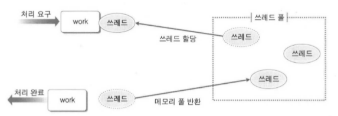
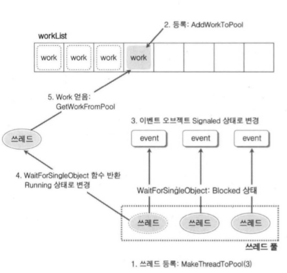

# 15장. 쓰레드 풀링

<br/>

## 1. 쓰레드 풀에 대한 이해

<br/>

- 쓰레드의 생성과 소멸은 시스템에 많은 부담을 주기 때문에, 빈번한 쓰레드의 생성과 소멸은 피해야 한다.
- 따라서, 쓰레드 풀을 유지하는 것은 성능 향상에 도움이 된다.
    - 쓰레드 풀의 기본 원리는 쓰레드의 재활용이다.
    - 할당된 일을 마친 쓰레드를 소멸시키지 않고, 쓰레드 풀에 저장해 뒀다가 필요할 때 다시 꺼내서 쓰는 개념이다.
    - 즉, 쓰레드의 생성과 소멸에 필요한 비용을 지불하지 않겠다는 것이다.

<br/>



<br/>

- 쓰레드 풀은 처리해야 할 일이 등록되기 전에 생성되는데, 풀이 생성됨과 동시에 쓰레드들도 생성되어 풀에서 대기하게 된다.
- 지능적인 풀은 처리해야 할 일의 증가 및 감소에 따라서 풀 안의 쓰레드 개수를 늘리기도 하고, 줄이기도 한다.
- 쓰레드 풀이 생성된 상태에서 처리해야 할 일이 하나 등록되었다고 가정하면, 쓰레드 풀에 존재하는 쓰레드 하나를 임의로 할당해서 일의 처리를 도모한다.
    - 만약, 풀에 존재하는 쓰레드 수보다 처리해야 할 일의 수가 많다면, 일의 순서대로 처리되도록 디자인할 수도 있고, 빠른 일 처리를 위해 추가적인 쓰레드가 생성되도록 풀을 디자인할 수도 있다.

<br/>

## 2. 쓰레드 풀의 구현

<br/>

### 쓰레드 풀 구현의 모듈별 해석

<br/>

```C
typedef void (*WORK) (void);
// 쓰레드에게 일을 시키기 위한 작업의 기본 단위
// 쓰레드에게 일을 시키기 위해서는 일에 해당하는 하나의 함수를 정의해야 함
// 이때 함수의 반환형과 매개변수 타입이 모두 void로 임의로 정하여, 변경 가능한 것 이어야 한다.

typedef struct __WorkerThread
{
    HANDLE hThread;
    DWORD idThread;
} WorkerThread;
// 생성되는 쓰레드의 정보를 담기 위한 구조체
// 간단하게 쓰레드의 핸들, 쓰레드의 id정보만 담았지만 필요에 따라서 확장 가능하다.

struct __ThreadPool
{
    WORK workList[WORK_MAX];
    // 일에 해당하는 함수를 등록하기 위한 저장소(배열)

    WorkerThread workerThreadList[THREAD_MAX];
    // 쓰레드 풀에 저장된 쓰레드의 정보를 저장
    HANDLE workerEventList[THREAD_MAX];
    // 각 쓰레드 별로 하나씩 할당되는 이벤트 동기화 오브젝트를 저장하는 배열
    // workerThreadList와 workerEventList에 등록된 쓰레드와 이벤트는 같은 인덱스에 해당하는 것과 동기화 오브젝트 쌍을 이룬다.
    
    DWORD idxOfCurrentWork;
    // 대기 1순위 Work Index
    // 처리되어야 할 work의 위치를 가리킨다.
    DWORD idxOfLastAddedWork;
    // 마지막 추가 Work Index + 1
    // 마지막에 추가된 work index보다 1많은 값을 유지하면서 새로운 work가 등록될 때 등록 위치를 가르쳐준다.

    DWORD threadIdx;
    // Pool에 존재하는 쓰레드의 개수

} gThreadPool; 
//typedef 선언 없이, 자료형 선언과 동시에 전역변수 형태로 gThreadPool을 선언
// 이는 쓰레드 풀을 표현하는 자료구조이다.
```

<br/>

**위의 쓰레드 풀 자료구조의 문제점**

<br/>

- idxOfCurrentWork와 idxOfLastAddedWork는 증가는 하지만 감소하지 않는다.
    - 따라서 WORK_MAX 만큼 일이 등록되고 나면 더 이상의 등록은 불가능하다.
- 해결책
    - 배열을 원형 배열의 형태로 변경하며 된다.
    - 또는 Work와 Work의 등록 여부를 나타내는 멤버로 구조체를 정의하고, 이를 기반으로 배열을 선언하는 방법도 고려할 수 있다.

<br/>

### 쓰레드 풀의 함수 관계

<br/>



<br/>

- WORK GetWorkFromPool (void);
    - 쓰레드 풀에서 Work를 가져올 때 호출하는 함수이다.
- DWORD AddWorkToPool (WORK work);
    -  새로운 Work를 등록할 때 호출하는 함수이다.
- DWORD MakeThreadToPool (DWORD numOfThread);
    - 쓰레드 풀이 생성된 이후에 풀에 쓰레드를 생성(등록)하는 함수이다.
    - 인자로 전달되는 수 만큼 쓰레드가 생성된다.
- void WorkerThreadFunction (LPVOID pParam);
    - 쓰레드가 생성되자마자 호출하는 쓰레드의 main 함수이다.
    - 이 함수의 구성을 봐야만 어떻게 Work를 할당받아서 처리하는지, 그리고 Work가 없을 때의 쓰레드 상태들을 알 수 있다.

<br/>

**쓰레드 풀 메커니즘**

<br/>

- 단계 1
    - 전역으로 선언된 쓰레드 풀에 MakeThreadToPool 함수의 호출을 통해서 쓰레드를 생성해 등록시킨다.
    - 이렇게 생성된 쓰레드는 이벤트 오브젝트가 Signaled 상태가 되기를 기다리며 Blocked 상태가 된다.
- 단계 2
    - AddWorkToPool 함수 호출을 통해서 Work를 등록한다.
- 단계 3
    - Work가 등록되면, 쓰레드 풀에서 Blocked 상태에 있는 모든 이벤트 오브젝트를 Signaled 상태로 변경한다.
- 단계 4
    - 모든 이벤트 오브젝트가 Signaled 상태가 되므로, 모든 쓰레드가 Running 상태가 된다.
    - 그러나 Work를 할당받은 하나의 쓰레드를 제외하고 나머지는 다시 Blocked 상태가 된다. (다소 비효율적인 부분)
        - 보통 쓰레드별로 각자 이벤트 오브젝트를 갖는게 아니라 하나의 이벤트 오브젝트를 두고, 그게 Signaled 상태가 되면 쓰레드 풀에서 쓰레드를 하나만 깨우거나(auto-reset), 전체를 깨운다(manual-reset).
- 단계 5
    - Running 상태로 남아있게 될 하나의 쓰레드는 GetWorkFromPool 함수 호출을 통해서 Work를 할당받아서 실행

**전역으로 선언된 쓰레드 풀 접근 동기화**

<br/>

- 쓰레드 풀에 해당하는 gThreadPool은 전역으로 선언되어 있고, 둘 이상의 쓰레드에 의해서 참조되는 메모리 영역이다.
- 따라서, gThreadPool의 접근에 동기화가 필요하다
- 이를 위해, 뮤텍스 기반 동기화 함수들을 래핑(Rapping)한 것이다.
    - void InitMutex();
    - void DeInitMutex();
    - void AcquireMutex();
    - void ReleaseMutex();