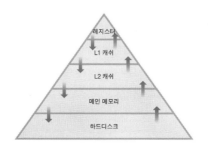

# 16장. 컴퓨터 구조에 대한 네 번째 이야기

<br/>

## 1. 메모리 계층(Memory Hierarchy)

<br/>

- 개발자 입장에서는 **메모리가 가장 중요한 요소**이다.
- 제한된 환경(CPU 속도는 결정된 사항)에서 가급적 높은 성능을 낼 수 있도록 프로그래밍을 하기 위해서 메모리의 특성을 잘 파악해야 한다.

<br/>

### 메모리의 범위와 종류

<br/>

- 보통 메모리라고 하면 메인 메모리에 해당하는 RAM을 생각하지만, 이는 부정확하게 표현되는 단어이다.
    - RAM이 사용되는 메인 메모리 이외에도 메모리라고 불릴 수 있는 요소들은 너무나도 많다.
    - 컴퓨터를 구성하는 요소 중에서 임시적이든, 영구적이든 저장 기능을 조금이라도 가지고 있다면 무조건 메모리의 범위에 포함된다.

<br/>

**1. 메인 메모리**

<br/>

- 가장 먼저 떠올릴 수 있는 메인 메모리인 RAM은 D-RAM 계열의 메모리이다.
- 메인 메모리가 반드시 RAM이어야 할 이유는 없지만, 거의 모든 컴퓨터가 메인 메모리로 RAM을 사용하므로 메인 메모리와 RAM을 동일한 의미로 사용한다.
- 이 관계에 항상 등호 관계가 성립하지 않는다.
    - 이는 **가상 메모리**를 공부하면 보다 명확해진다.

<br/>

**2. 레지스터**

<br/>

- CPU 안에 내정되어 있어서 연산을 위한 저장소를 제공한다.

<br/>

**3. 캐쉬(Cache)**

<br/>

- 캐쉬는 D-RAM보다 빠른 S-RAM으로 구성하는데, RAM이라는 단어는 메인 메모리를 의미하는 용도로 사용되므로, 캐쉬 메모리는 그냥 캐쉬라고 표현한다.
- 캐쉬는 CPU와 램 사이에서 중간 저장소 역할을 하는 메모리이다.
- 캐쉬 메모리는 원래 CPU의 일부로 존재하는 메모리 개념이 아닌, CPU에 근점해 있는 메모리 개념이다.
    - CPU의 일부로 존재하는 메모리는 레지스터이다.

<br/>

**4. 하드디스크 와 이외의 저장 장치들**

<br/>

- 하드디스크는 크고 작은 파일들을 저장하기 위한 용도로 사용되지만, 프로그램 실행에 있어서도 중요한 의미를 지닌다.
- 이 외에도 SD 카드, CD-ROM과 같은 I/O 장치들도 메모리에 해당한다.

<br/>

**"프로그래머는 레지스터, 캐쉬, 메인 메모리, 하드디스크 뿐만 아니라 그 밖의 I/O 장치들과의 입/출력 타이밍 및 대기 시간 등을 가장 중요한 요소로 생각하고 항상 고민해야 한다."**

<br/>

### 메모리 계층 구조

<br/>

- 프로그램이 실행되는 동안에 메모리가 하는 역할은 데이터의 입력 및 출력이다.
    - 따라서, 기본적인 역할은 모든 메모리가 동일하다.
- 가장 큰 차이점은 CPU를 기준으로 얼마나 멀리 떨어져 있느냐이다.
    - CPU - 레지스터 - 캐쉬 - RAM - 하드디스크
- CPU와 가까이에 있을수록 빠르고, 멀리 있을수록 속도가 느리다.
- CPU의 레지스터 접근은 별다른 절차가 필요 없지만, 메인 메모리에 접근하기 위해서는 몇몇 복잡한 과정을 거쳐야 한다.
    - 대표적으로 버스 인터페이스 컨트롤이다.
    - 데이터를 입력 및 출력하기 위해서 메모리 버스를 거쳐야 하기 때문에 그만큼 더 느리다.

<br/>



<br/>

- 위 그림은 메모리의 계층 구조 및 메모리 계층 구조별 데이터 캐쉬를 나타낸 개념도이다.

<br/>

- 하드디스크 -> 레지스터
    - 하드디스크에 있는 내용은 프로그램의 실행을 위해서 메인 메모리로 이동한다.
    - 메인 메모리에 있는 데이터 일부도 실행을 위해서 L2 캐쉬로 이동한다.
    - L2 캐쉬에 있는 데이터 일부는 L1 캐쉬로 이동을 하고, L1 캐쉬에 있는 데이터 중에서 연산에 필요한 데이터가 레지스터로 이동한다.
- 즉, 모든 메모리의 역할은 피라미드 구조에서 자신보다 아래에 있는 메모리를 캐쉬(자주 사용되는 메모리의 일부를 저장해서 속도를 향상시키는 것)하기 위해서 존재하는 것으로 이해

<br/>

- 레지스터 -> 하드디스크
    - 연산에 필요한 데이터가 레지스터에 존재하지 않는다면 L1 캐쉬를 확인
    - L1 캐쉬도 가지고 있지 않다면, L2 캐쉬를 확인
    - L2 캐쉬도 가지고 있지 않다면 메인 메모리를 확인
    - 메인 메모리에도 존재하지 않는다면 하드디스크 확인

<br/>

- 우리가 사용하는 시스템에서는 캐쉬 메모리가 높은 성능 향상을 가져다 준다.
- 메인 메모리를 제외한 L1 캐쉬와 L2 캐쉬에, 연산에 필요한 데이터가 존재할 확률이 90% 이상 된다.

<br/>

## 2. 캐쉬(Cache)와 캐쉬 알고리즘

<br/>

- 기술력과 금전적 문제가 해결되어서 하드디스크와 동일한 크기의 레지스터를 가지고 있다면, 캐쉬 메모리 자체가 필요가 없다. 하지만 이는 현실적으로 불가능하다.
- 캐쉬 메모리는 컴퓨터 성능을 향상시키는데 아주 중요한 역할을 한다.

### 컴퓨터 프로그램의 일반적인 특성

<br/>

```C
#define ARR_LEN 5
void bubblesort(int srcArr [], int n)
{
    int i, j, temp;
    for(i=0; i<; i++)
    {
        for(j=1, j<n-1; j++>)
        {
            if (srcArr[j-1] > srcArr[j])
            {
                temp = srcArr[j-1];
                srcArr[j-1] = srcArr[j];
                srcArr[j] = temp;
            }
        }

        int_tmain(int argc, TCHAR ** argv)
        {
            int arr[ARR_LEN] = {5, 3, 7, 6, 9};
            bubblesort(arr, ARR_LEN);
            for (int i=0; i<ARR_LEn; i++)
                printf("%d, ", arr[i]);
            return 0;
        }
    }
}
```

- 지역변수 i, j, temp의 특성은 선언 및 초기화 이후 다양한 값으로 변겨도 되고, 값을 얻기 위한 참조도 빈번하게 일어나게 된다.
- 위 지역변수의 특성을 가리켜 템퍼럴 로컬리티(Temporal Locality)라고 한다.
- 이는 프로그램 실행 시 한번 접근이 이뤄진 주소의 메모리 영역은 자주 접근하게 된다는 프로그램 특성을 표현할 때 사용하는 말이다.

<br/>

- srcArr[j-1] = srcArr[j]
- 이 코드에서도 템퍼럴 로컬리티의 특성을 발견할 수 있다.
- 하지만, 이 코드에서는 한 번은 값을 변경하기 위해 그리고 또 한 번은 값을 참조하기 위해서 두 번 접근하게 된다.
- 이러한 특성을 가리켜 스페이셜 로컬리티(Spatial Locality)라고 한다.
- 이는 프로그램 실행 시 접근하는 메모리 영역은 이미 접근이 이루어진 영역의 근처일 확률이 높다는 프로그램의 성격을 표현할 때 사용한다.

<br/>

- Temporal Locality와 Spatial Locality를 고려한 코드를 캐쉬 프렌들리 코드(Cache Friendly Code)라고 한다.