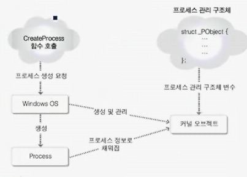
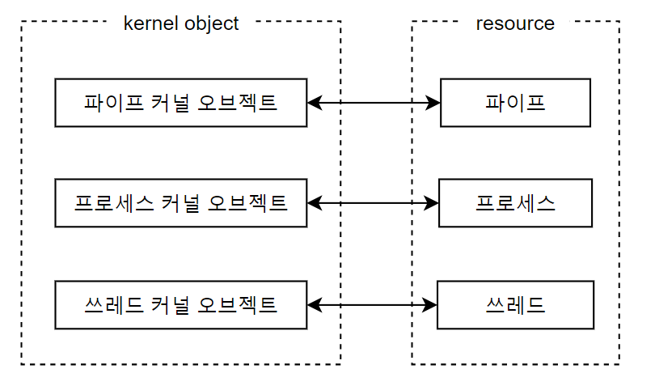
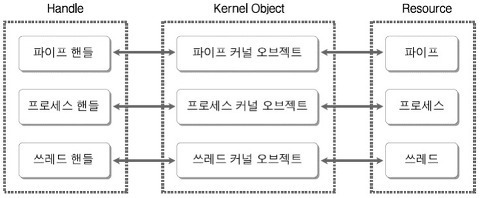

# 6장. 커널 오브젝트와 오브젝트 핸들

<br/>

## 1. 커널 오브젝트에 대한 이해

<br/>

### 커널 오브젝트

<br/>

- 커널에서 관리하는 중요한 정보를 담아둔 데이터 블록을 가리켜 커널 오브젝트라 한다.

<br/>

### 커널 오브젝트의 이해

<br/>

**CreateProcess 함수 호출을 통해 프로세스 생성**

<br/>

- 이는 CreateProcess 함수 호출을 통해 프로세스 생성을 요구한 것이고, Windows 운영체제가 우리의 요구에 맞게 프로세스를 생성해준 것
- 따라서, 프로세스를 생성하는 실질적인 주체는 **운영체제**이다.
- 이렇듯, 프로세스 관리(프로세스 생성 및 소멸, 프로세스 상태 변화)도 운영체제의 몫이다.

<br/>

**프로세스 관리 구조체**

<br/>

- 동시에 여러 개의 프로세스를 관리하기 위해, 운영체제 입장에서 고정적으로 저장하고 갱신해야 할 정보들이 존재한다.
- 예를 들어, 프로세스 상태 정보(Running, Blocked, Ready 상태)와 우선순위 정보는 운영체제 내부에 저장되어야 한다.
- 그리고 **프로세스 스케줄러**가 프로세스 상태 정보와 프로세스 우선순위 정보가 변경될 때 마다 갱신되어야 이를 바탕으로 프로세스를 관리할 수 있음

- **운영체제가 프로세스를 관리하기 위해서는 프로세스에 관련된 몇몇 정보를 저장할 수 있어야 하고, 참조 및 변경도 가능해야 한다.**
- 이를 위해, 고안된 것이 **프로세스 관리 구조체**이다.

<br/>

**커널 오브젝트의 정체**

<br/>



<br/>

- 프로세스가 생성될 때 마다 **'프로세스 관리 구조체' 변수**가 하나씩 생성되고, 새롭게 생성된 프로세스 정보들로 초기화되는데, 이것이 **커널 오브젝트**이다.

<br/>

### 그 이외의 커널 오브젝트들

<br/>

- 프로세스가 생성될 때에만 커널 오브젝트가 생성되는 것은 아니다.
- 프로세스 내에서 프로그램 흐름을 구성하는 쓰레드를 생성할 때 에도, IPC(Inter Process Communication)를 위해 사용되는 파이프나 메일슬롯을 생성할 때 에도 커널 오브젝트를 생성해서 필요한 정보를 채워 운영체제가 이들을 관리할 수 있도록 해야 한다.
- 뿐만 아니라, Windows에서는 파일을 생성할 때 파일 조차도 커널에 의한 관리 대상이므로 커널 오브젝트가 생성된다.

<br/>

**Windows에서 만드는 모든 종류의 커널 오브젝트들은 동일한 구조체로부터 생성될까?**
- 대상에 따라서 관리되어야 할 사항이 다르기 때문에 커널 오브젝트 형태(커널 오브젝트를 구성하는 멤버)도 다르다. 그렇기 때문에 커널 오브젝트 종류에 따라 서로 다른 구조체를 기반으로 생성된다.

<br/>

> **요약** <br/> Windows 운영체제는 프로세스, 쓰레드 혹은 파일과 같은 리소스(Resource)들을 원활하게 관리하기 위해서 필요한 정보를 저장해야 한다. 이 때 데이터를 저장하는 메모리 블록을 가리켜 커널 오브젝트라고 한다.

<br/>



<br/>

### 오브젝트 핸들(Handle)을 이용한 커널 오브젝트의 조작

<br/>

- 프로그래머가 커널 오브젝트를 직접 조작할 수 없지만, 프로세스 우선순위 변경과 같은 Windows에서 관리하는 리소스 특성을 변경시키기 위해 해당 리소스의 커널 오브젝트를 마이크로소프트에서 제공하는 시스템 함수를 이용하여 간접적으로 조작할 수 있다.

<br/>

**프로세스의 우선순위(Priority) 변경**

<br/>

- 커널 오브젝트에 저장된 우선순위 정보 변경

<br/>

```c
BOOL SetPriorityClass (
    HANDLE hProcess,
    DWORD dwPriorityClass
);
```
- hProcess: 우선순위를 변경할 프로세스의 핸들(Handle) 전달
- dwPriorityClass: 새롭게 적용할 우선순위 정보 전달

<br/>

> "SetPriorityClass 함수의 첫 번째 인자로 전달된 hProcess가 가리키는 프로세스의 우선순위를 두 번째 인자로 전달된 dwPriorityClass로 변경"

<br/>

**커널 오브젝트에 할당되는 숫자! 핸들(Handle)**

<br/>

- 특정 프로세스의 우선순위를 높이기 위해서 프로세스 커널 오브젝트에 존재하는 우선순위 정보를 변경해 줘야한다.
- Windows는 커널 오브젝트를 생성할 때 마다 특정 커널 오브젝트를 가리키는 **핸들**이라는 정수값을 하나씩 부여하기 때문에 **SetPriorityClass** 함수를 통해서 커널 오브젝트를 지시할 수 있다.
- **SetPriorityClass** 함수의 첫 번째 인자를 통해 우선 순위를 변경하고자 하는 프로세스의 커널 오브젝트를 가르키는 핸들을 전달한다.

<br/>

