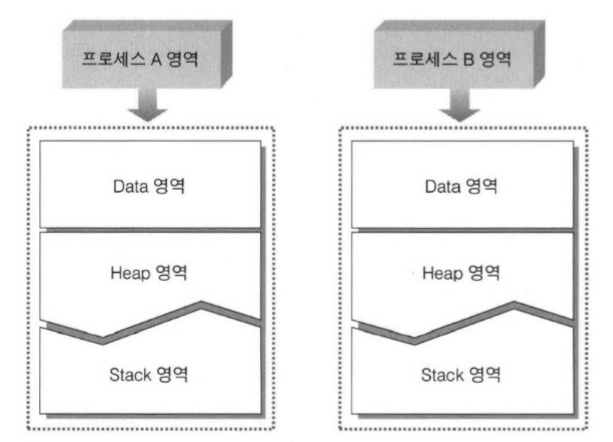

# 7장. 프로세스간 통신 (IPC) 1

 

## 1. 프로세스간 통신(IPC)의 의미

 

- IPC: Inter-Process Communication의 약자로서, 프로세스 사이의 통신이라는 뜻을 갖는다.
- 프로세스들이 서로 통신한다는 의미
    - 통신이란 기본적으로 데이터를 주고 받는 행위이다.
    - 프로세스들이 서로 통신을 한다는 것은 둘 이상의 프로세스가 데이터를 주고 받는 행위라고 정의할 수 있다.

 

### 프로세스 사이에서 통신이 이뤄지기 위한 조건

 

- 인간 세계에서의 IPC는 전화, 메신저, 소포 등이 있다.
- 프로세스들 사이에서는 공유하는 메모리 영역의 존재 여부, 즉 서로 만날 수 있는 여건이 갖춰지면 프로세스간 통신은 매우 쉽다.
- 하지만, 여건이 허락되지 않는다면 보조 수단이 필요하다.

 

### 프로세스들이 서로 만날 수 없는 이유

 

- 프로세스들은 서로 만나서 데이터를 주고 받는 것이 불가능하다.
    - 서로 데이터를 주고 받을만한 접선 장소를 마련할 수 없기 때문
- 프로세스들은 자신에게 할당된 메모리 공간 이외에는 접근이 불가능하다.

 

 

- 위 그림처럼 프로세스별 독립적인 메모리 공간이 나뉘어져 있다.
    - 따라서, 한 프로세스가 다른 프로세스의 메모리 공간을 접근할 수 없고, 프로세스간 통신이 어려워진다. -> 다른 통신수단을 고려해야함

 

### 프로세스들이 서로 만나지 못하게 디자인한 이유

 

- 오늘날 모든 운영체제들은 프로세스가 자신에게 할당된 메모리 공간 이외의 영역에 접근하는 것을 허용하지 않는다.
    - 왜냐하면, 프로그램의 안정성을 높이기 위해서이다.
    - 예를 들어, MP3 Player와 MS WORD 프로그램이 있다고 하자.
        - 각 프로그램은 각각의 프로세스가 실행중이고, 만약 한 프로세스가 자신에게 할당된 메모리 공간 이외의 다른 영역에 접근이 가능하다면 메모리 공간을 망가뜨리게 된다.
        - 따라서, 서로 다른 프로세스의 메모리 영역은 어떤 방식으로든 서로 영향을 끼칠 수 없어야 한다.

 

## 2. 메일슬롯 방식의 IPC

 

### 메일슬롯(Mail Slot) 원리

 

- 메일슬롯은 파이프와 더불어 대표적인 IPC 기법이다.
- 메일슬롯은 선형적인 메모리 구조의 특성을 반영한 이름이다.
- "데이터를 주고받기 위해 프로세스가 우체통을 마련하는 것"
- 데이터를 전달하고자 하는 Sender는 메일슬롯이라는 우체통을 향해 데이터를 날린다.
- 그러면 Receiver는 메일슬롯을 통해서 데이터를 얻는다.

 

### 메일슬롯(Mail Slot) 구성을 위해서 필요한 요소

 

1. Receiver가 준비해야 하는 것
    - Receiver에 해당하는 프로세스는 메일슬롯(우체통)을 생성해야 함
2. Sender가 준비해야 하는 것
    - Sender는 데이터를 Receiver에게 보내는 역할이다.
    - 따라서, Receiver가 만들어 둔 메일슬롯의 이름을 알아야 함.
    - 메일슬롯은 파일이 아니지먼, 파일 입출력 함수를 사용하여 데이터를 주고 받는다.
        - 메일슬롯은 Windows 파일 시스템을 기반으로 구현되어 있다.
        - 따라서, 파일 입출력을 하는 함수를 만들게 되면 기존 Windows 파일 시스템을 기반으로 구현된 함수와 같은 기능을 하는 함수가 중복되기 때문에 MS에서는 새로 함수를 만들지 않고, 기존의 파일 시스템 기반의 함수를 그대로 사용하기로 결정

 

### 메일슬롯의 고찰과 앞으로의 전개에 대해서

 

- 메일슬롯은 단방향 통신만 가능하다.

 

**메일슬롯과 IPC에 대한 고찰**

 

- 메일슬롯은 한쪽 방향으로만 메시지를 전달할 수 있다.
    - 따라서, 서로 다른 두 프로세스가 서로 메세지를 주고 받기 위해서는 두 개의 메일슬롯을 생성해야 한다.
    - 양쪽 방향으로 메세지를 주고 받기 위해 사용 가능한 IPC 기법도 존재한다.
        - Anonymous 파이프와 Named 파이프

 

- 메일슬롯은 브로드캐스팅 방식의 통신을 지원한다.
    - 하나의 Sender는 한번의 메세지 전송으로 여러 Receiver에게 동일한 메세지를 동시에 전송하는 것이 가능하다.

 

## 3. Signaled vs Non-Signaled

 

- 이 장에서는 프로세스 핸들 테이블을 공부할 대 유용한 커널 오브젝트의 상태에 대해서 설명한다.

### 커널 오브젝트의 두 가지 상태

 

- Windows 운영체제에 의해 생성되는 커널 오브젝트는 두 가지 상태를 갖는다.
- 이는 리소스에 특정 상황이 발생했음을 알리기 위한 용도로 사용된다.

 

**상태에 대한 이해**

 

- 커널 오브젝트에서 상태(state)라는 용어를 사용하는 이유
    - 상태란 항상 고정적인 것이 아니고, 특정 상황에 따라서 변하는 것
    - 커널 오브젝트도 마찬가지로 두 가지 상태로 변화한다.
        - Signaled 상태 (신호를 받은 상태)
        - Non-Signaled 상태 (신호를 받지 않은 상태)
- 대부분의 사물처럼 오브젝트 커널 역시 한쪽 상태에서 다른 상태로 변경된다.
- 커널 오브젝트의 상태 정보는 멤버변수 중 하나에 의해서 표현되고 저장된다.
    - Non-Signaled 상태라면 False
    - Signaled 상태라면 True

 

**프로세스 커널 오브젝트의 상태(State)에 대한 이해**

 

- 커널 오브젝트의 상태 존재 이유
    - 리소스에 특정 상항이 발생하였음을 알려주기 위해서 존재한다.
    - 하지만, 특정 상황이라는 것은 리소스마다 다르다.
        - 따라서, 커널 오브젝트마다 상태가 변하는 시점이 다르다.

 

- 프로세스 커널 오브젝트는 프로세스가 생성될 때 만들어진다.
    - 처음 생성되면, 프로세스의 커널 오브젝트는 Non-Signaled 상태에 놓인다.
    - 프로세스가 종료되면 프로세스의 커널 오브젝트는 Signaled 상태로 변경된다.
    - 프로세스 커널 오브젝트의 상태를 보고 프로세스의 종료를 알 수 있다.
- 반대로 Signaled -> Non-Signaled 상태로 변경되는 경우
    - 이는 당연하게 종료된 프로세스가 다시 실행되는 경우라고 생각하지만, 불가능하다.
    - 즉, 프로세스의 커널 오브젝트의 상태는 Signaled가 되면 절대로 다시 Non-Signaled 상태로 변경될 수 없다.

 

### 커널 오브젝트의 상태 확인이 필요한 상황의 연출

 

- 핸들을 인자로 전달해서 커널 오브젝트의 상태를 확인하는데 사용하는 함수
    - **WaitForSingleObject**

 

**WaitForSingleObject 함수의 유용성**

 

- WaitForSingleObject 함수에 자식 프로세스의 핸들을 인자로 넘겨서 호출하면 부모 프로세스는 자식 프로세스가 종료될 때 가지 기다리는 효과를 갖는다.
    - 프로세스의 커널 오브젝트는 생성과 동시에 Non-Signaled 상태가 된다.
    - 따라서, 부모 프로세스가 이 함수를 호출한다면 블로킹 상태에 놓인다.
    - 즉, 부모 프로세스는 더 이상 실행되지 않고 함수의 블로킹 상태에서 빠져나오기를 기다리는 것이다.
    - 이 상태에서 자식 프로세스가 종료되면, 자식 프로세스의 커널 오브젝트는 Signaled 상태가 된다.
    - 그 후, 부모 프로세스는 블로킹 상태에서 빠져나와 나머지 부분을 실행한다.